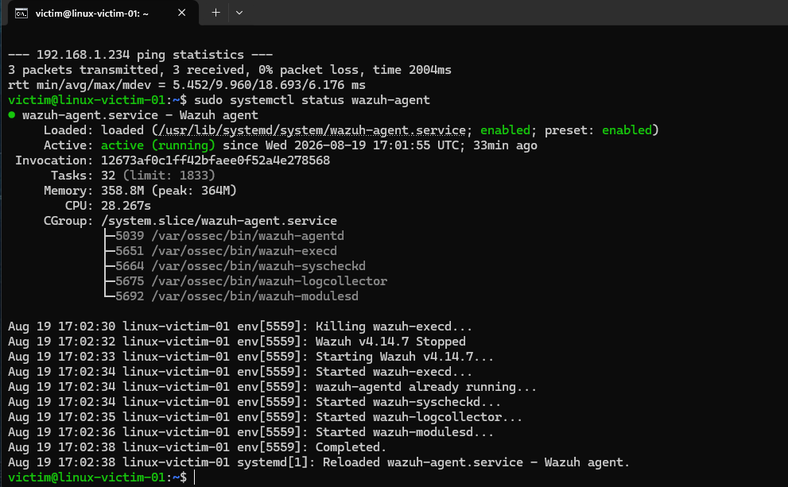
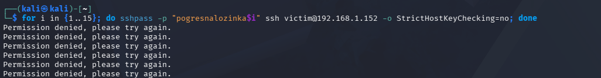
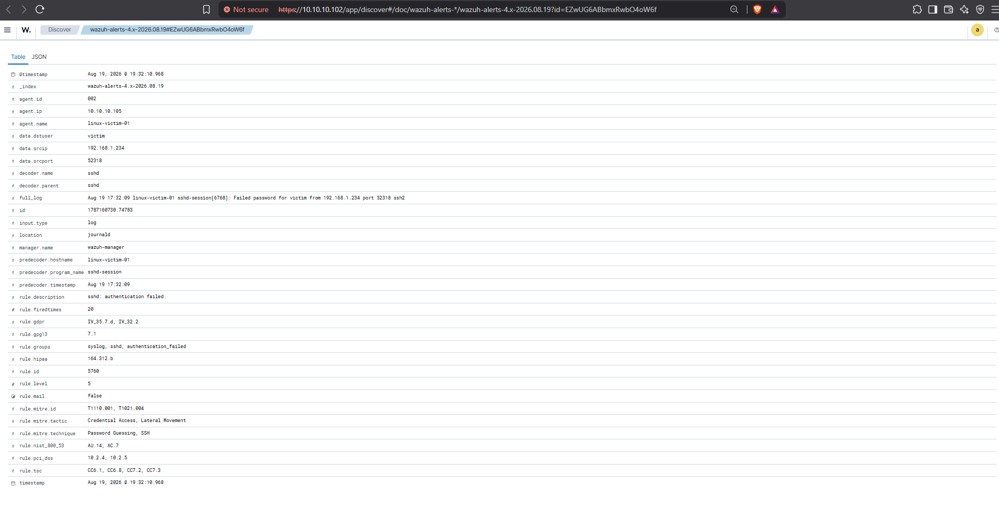

# Writeup #2: Linux Agent Integration & SSH Brute-Force Threat Detection

## Overview
In this phase of the lab, a target Linux endpoint (`linux-victim-01`) was integrated with the central Wazuh SIEM manager. A real-world SSH Brute-Force (Password Guessing) attack was simulated from an external attacker machine (Kali Linux) routed through pfSense Port Forwarding. The goal was to validate the log ingestion pipeline, verify Wazuh detection rules, and map the incident details to the MITRE ATT&CK framework.

---

## Network Architecture & Lab Components

* **SIEM / Log Collector:** Wazuh Manager (`10.10.10.102`)
* **Edge Firewall & NAT:** pfSense (`192.168.1.152` WAN / `10.10.10.1` LAN)
* **Target / Endpoint:** Ubuntu Linux (`linux-victim-01` - `10.10.10.105`)
* **Attacker Node:** Kali Linux (`192.168.1.234`)

---

## Step 1: Agent Installation & Enrollment

1. Installed the official `wazuh-agent` package on the Ubuntu target (`linux-victim-01`).
2. Configured the agent to point to the Wazuh Manager IP (`10.10.10.102`) over port 1514/1515.
3. Verified agent service state and active connection:

```bash
sudo systemctl status wazuh-agent
```


*Figure 1: Wazuh agent running active on the target host.*

---

## Step 2: Attack Simulation (SSH Password Guessing)

To simulate an external initial access attempt, an automated SSH password guessing attack was launched from the Kali Linux host against the pfSense WAN IP (`192.168.1.152:22`), which forwarded the traffic to the internal target host (`10.10.10.105:22`):

```bash
for i in {1..15}; do sshpass -p "wrongpassword$i" ssh victim@192.168.1.152 -o StrictHostKeyChecking=no; done
```

All authentication attempts were rejected by the SSH daemon (`Permission denied`), generating corresponding failure logs in `/var/log/auth.log` on the target machine.


*Figure 2: Execution of automated SSH login attempts on Kali Linux.*

---

## Step 3: SIEM Detection & Telemetry Analysis

The Wazuh `logcollector` daemon monitored `/var/log/auth.log` in real time and forwarded log events to the Wazuh Manager.

1. **Detection Spike:** A sudden burst of authentication events was flagged on the security monitoring dashboard.


*Figure 3: Event volume spike recorded on the Wazuh Dashboard.*

2. **Event Parsing & Telemetry Details:**
   * **Rule IDs:** `5760` / `5710` (*sshd: authentication failed*)
   * **MITRE ATT&CK Mapping:** Tactic: *Credential Access* | Technique: *Password Guessing* (`T1110.001`)
   * **Source IP (`data.srcip`):** `192.168.1.234` (Kali Linux Attacker)
   * **Target User (`data.dstuser`):** `victim`
   * **Target Agent (`agent.name`):** `linux-victim-01` (`10.10.10.105`)


*Figure 4: Expanded JSON payload detailing attack telemetry and MITRE mapping.*

---

## Remediation & Mitigation Strategies

To secure the endpoint against brute-force attacks in a production environment:

1. **Key-Based Authentication:** Disable password authentication in `/etc/ssh/sshd_config` (`PasswordAuthentication no`) and enforce SSH public keys.
2. **Automated IP Banning:** Implement **Fail2ban** or configure Wazuh **Active Response** to dynamically block malicious IPs on the host/firewall after multiple failed attempts.
3. **Network Hardening:** Restrict public access to SSH (Port 22) via firewall rules or require a VPN connection for administrative access.
